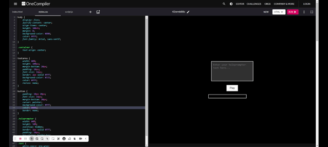

# Teleprompt

!Teleprompt

## Overview

Teleprompt is a modern, web-based teleprompter application designed to provide an easy-to-use, accessible platform for delivering speeches and presentations. Leveraging HTML, CSS, and JavaScript, Teleprompt offers a seamless experience for users looking to practice and deliver their speeches with real-time feedback and control.

## Features

- **Voice Activation**: Navigate through your script with simple voice commands.
- **Real-Time Speech Recognition**: Utilizes the WebSpeech API for accurate, real-time speech recognition.
- **Customizable Display**: Adjust text size, scroll speed, and more to suit your presentation style.
- **Responsive Design**: Works across various devices, from desktops to tablets, ensuring accessibility anywhere.

## Getting Started

To get started with Teleprompt, clone this repository to your local machine:

```bash
git clone https://github.com/yourusername/teleprompt.git
cd teleprompt

Open `index.html` in your preferred web browser to launch the application. No additional setup is required.

## Usage

1. **Prepare Your Script**: Enter your speech or presentation script into the teleprompter’s text area.
2. **Customize Settings**: Adjust the teleprompter settings to match your reading preference, including font size and scroll speed.
3. **Start the Teleprompter**: Use the voice-activated commands or the on-screen controls to start, pause, or reset the teleprompter as needed during your practice or presentation.

## Options

Teleprompt offers a wide range of options to customize your teleprompting experience to best suit your presentation needs. Here are the options available:

- **Start**: Begins the teleprompter scrolling, allowing you to start your presentation.
- **Pause**: Temporarily halts the teleprompter, enabling you to take a moment or catch up if needed.
- **Restart**: Resets and starts the teleprompter from the beginning of your script.
- **Edit Text**: Allows you to modify the script directly in the teleprompter interface.
- **Language**: Choose the language for speech recognition, ensuring accurate real-time feedback.




## Contributing

Contributions are welcome! Please fork this repository and submit a pull request for any enhancements or bug fixes.

## License

This project is licensed under the MIT License. See the LICENSE file for details.
